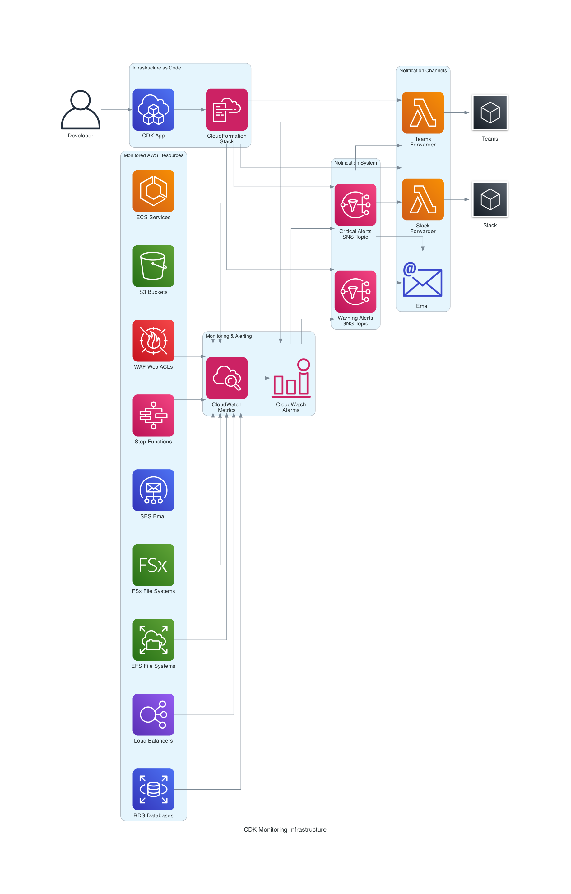
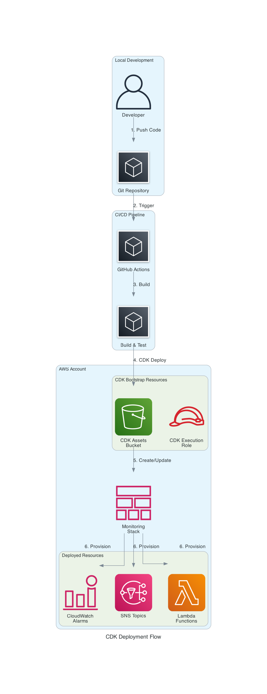

# Architecture Overview

## Table of Contents

- [Architecture Diagrams](#architecture-diagrams)
- [High-Level Architecture](#high-level-architecture)
- [Multi-Environment Setup](#multi-environment-setup)
- [Notification Routing](#notification-routing)
- [Security Architecture](#security-architecture)
- [Cost Breakdown](#cost-breakdown)
- [Operational Health](#operational-health)
- [CDK Best Practices](#cdk-best-practices)

## Architecture Diagrams

### System Architecture

This diagram shows the complete monitoring infrastructure including monitored resources (S3, ECS, RDS, ELB, EFS, FSx, SES, Step Functions, WAF), CloudWatch metrics and alarms, SNS topic routing, and notification channels (Email, SMS, Slack, Teams). Currently, only S3 monitoring is active by default; other services are stubbed out in the CDK code and ready to enable. Slack and Teams integrations have not been tested yet.



### Deployment Flow

This diagram illustrates the deployment process from code push through GitHub Actions, CDK deployment, CloudFormation provisioning, and final resource readiness for monitoring.



## High-Level Architecture

The monitoring infrastructure consists of these key components:

**1. Monitored Resources** → Send metrics to CloudWatch
- ECS Services, RDS Instances, Load Balancers, S3 Buckets
- EFS Systems, FSx Systems, Step Functions, WAF ACLs, SES

**2. CloudWatch Alarms** → Evaluate metrics against thresholds
- ECS: 3 alarms per service (CPU, memory, task count)
- RDS: 4 alarms per instance (CPU, storage, read/write latency)
- ELB: 4 alarms per load balancer (response time, unhealthy hosts, 5xx errors)
- S3: 2 alarms per bucket (size, object count)
- EFS: 2 alarms per file system (burst credits, IO limit)
- FSx: 2 alarms per file system (storage utilization, free storage)
- SES: 2 alarms per account (bounce rate, complaint rate)
- Step Functions: 2 alarms per state machine (failed, timed out)
- WAF: 1 alarm per web ACL (blocked requests)
- Configured with centralized thresholds in `lib/config/alarm-thresholds.ts`

**3. SNS Topics** → Route notifications
- Critical Alarm Topic (for production issues)
- Warning Alarm Topic (for non-critical issues)

**4. Notification Channels** → Deliver alerts
- Email (both critical and warning)
- SMS (critical only)
- Slack (via Lambda forwarder - optional)
- Teams (via Lambda forwarder - optional)

**Flow**: Resources → CloudWatch Metrics → Alarms → SNS Topics → Notifications

## Multi-Environment Setup

This is an example deployment pattern using three environments (dev, staging, prod) with separate AWS accounts, which is the recommended best practice for environment isolation.

**Deployment Flow:**
```
GitHub Repository (main branch)
    ↓
GitHub Actions CI/CD
    ↓
Build → Test → Deploy
    ↓
┌─────────────┬──────────────┬──────────────┐
│   Dev       │   Staging    │   Prod       │
│ Account     │   Account    │   Account    │
│ (Auto)      │   (Auto)     │   (Manual)   │
└─────────────┴──────────────┴──────────────┘
```

**Environment Isolation:**
- Each environment deploys to a separate AWS account
- Same code, different configurations (account IDs, thresholds)
- Dev: Automatic deployment on merge
- Staging: Automatic deployment after dev succeeds
- Prod: Manual approval is required in this example

> **Note:** Refer to [Multiple Environments setup](GITHUB_ACTIONS_SETUP.md#multiple-environments) guide for details.

## Notification Routing

### Critical Alarms (Production)
```
CloudWatch Alarm → SNS Critical Topic → SMS
                                      → Email
                                      → Slack (#aws-alerts-prod)
                                      → Teams (AWS Alerts)
```

### Warning Alarms (All Environments)
```
CloudWatch Alarm → SNS Warning Topic → Email
                                     → Slack (#aws-warnings)
```

### Development Alarms
```
CloudWatch Alarm → SNS Critical Topic → Slack (#aws-alerts-dev)
```

## Security Architecture

### IAM Permissions

**Lambda Execution Role:**
- `logs:CreateLogGroup`
- `logs:CreateLogStream`
- `logs:PutLogEvents`

**SNS Topic Policy:**
- Allow CloudWatch to publish alarms
- Allow Lambda to subscribe for forwarding

**CloudWatch Alarms:**
- Allow SNS actions on notification topics

### Secrets Management

**Webhook URLs (for Slack/Teams):**
- **Recommended**: AWS Secrets Manager
- **Alternative**: Lambda environment variables
- **Not Recommended**: CDK context or hardcoded values

**Best Practices:**
- Store sensitive values in Secrets Manager
- Use IAM roles instead of access keys where possible
- Enable MFA for deployment users
- Rotate credentials regularly
- Use least privilege policies

## Cost Breakdown

```
CloudWatch Alarms
├── First 10 alarms: Free
├── Next 247 alarms: $0.10 × 247 = $24.70/month
└── Total: $24.70/month

SNS
├── First 1,000 emails: Free
├── SMS: $0.00645 per message (variable)
└── Total: ~$0.50/month (excluding SMS)

Lambda
├── First 1M requests: Free
├── Compute time: Minimal
└── Total: ~$0.20/month

Total Monthly Cost: ~$25-30/month (excluding SMS)
```

## Operational Health

To ensure the monitoring system itself is healthy:

**Lambda Functions:**
- CloudWatch Logs capture all execution details for debugging
- Lambda Insights provide performance metrics
- Dead Letter Queues catch failed notification attempts

**SNS Topics:**
- CloudWatch Metrics track message delivery success/failure rates
- Failed delivery notifications alert when messages can't be sent

**CloudWatch Alarms:**
- Composite alarms can monitor the health of other alarms
- Alarm state changes are logged for audit trails

**Best Practices:**
- Set up alarms on Lambda errors for Slack/Teams forwarders
- Monitor SNS delivery failure rates
- Review CloudWatch Logs regularly for Lambda execution issues
- Use CloudWatch Dashboards to visualize monitoring system health

## CDK Best Practices

This project follows AWS CDK best practices for infrastructure-as-code development:

**Code Organization:**
- Constructs organized by service type (`lib/constructs/alarms/`, `lib/constructs/notifications/`)
- Configuration separated from infrastructure code (`lib/config/`)
- Environment-specific settings externalized

**Security:**
- Least-privilege IAM policies for GitHub Actions OIDC
- No hardcoded credentials or secrets in code
- Secrets Manager recommended for webhook URLs

**Multi-Environment:**
- Single codebase deploys to multiple environments
- Environment-specific configuration via context
- Separate AWS accounts for environment isolation

**Testing & Deployment:**
- `cdk diff` before deployment to preview changes
- CloudFormation change sets for safe updates
- GitHub Actions for automated CI/CD (optional)

For comprehensive guidance, see the [AWS CDK Best Practices Guide](https://docs.aws.amazon.com/cdk/v2/guide/best-practices.html).
